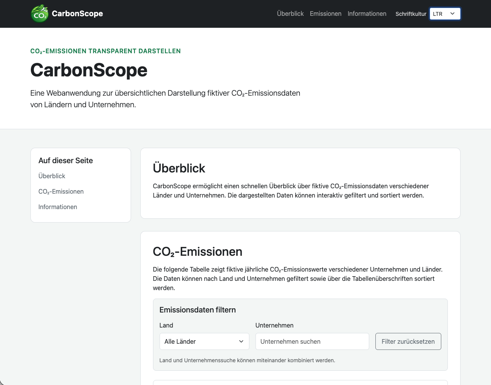
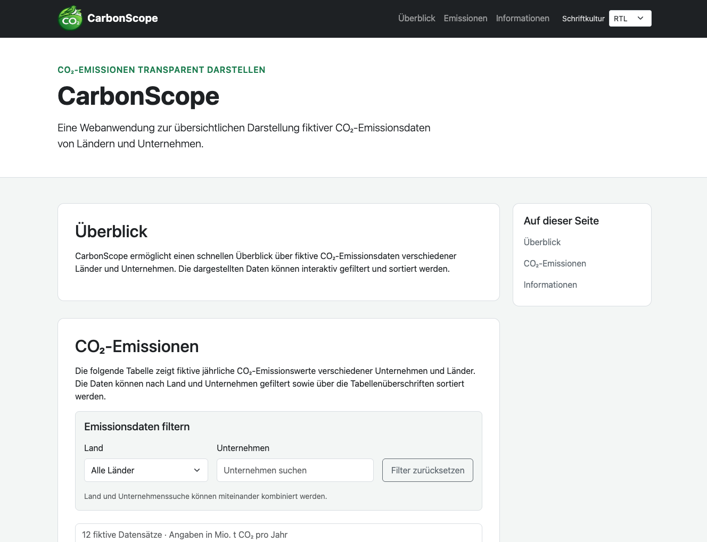
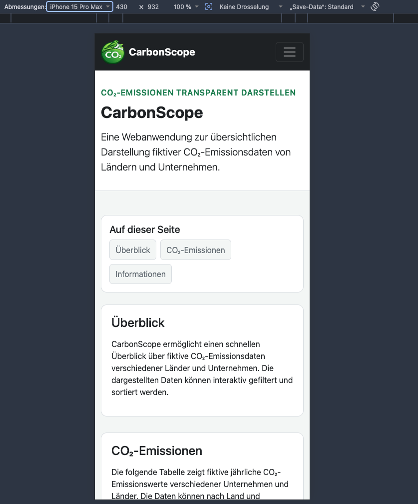
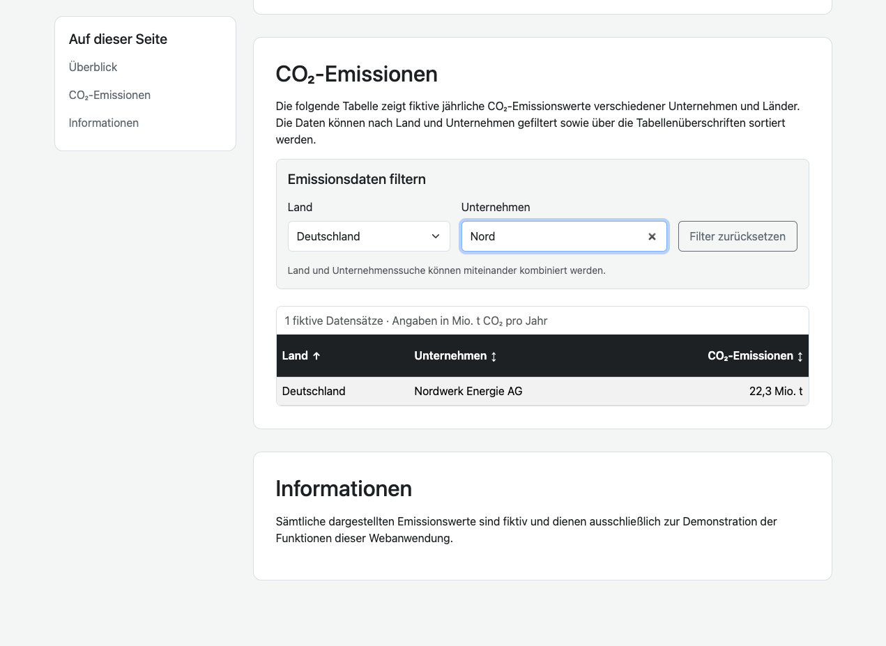
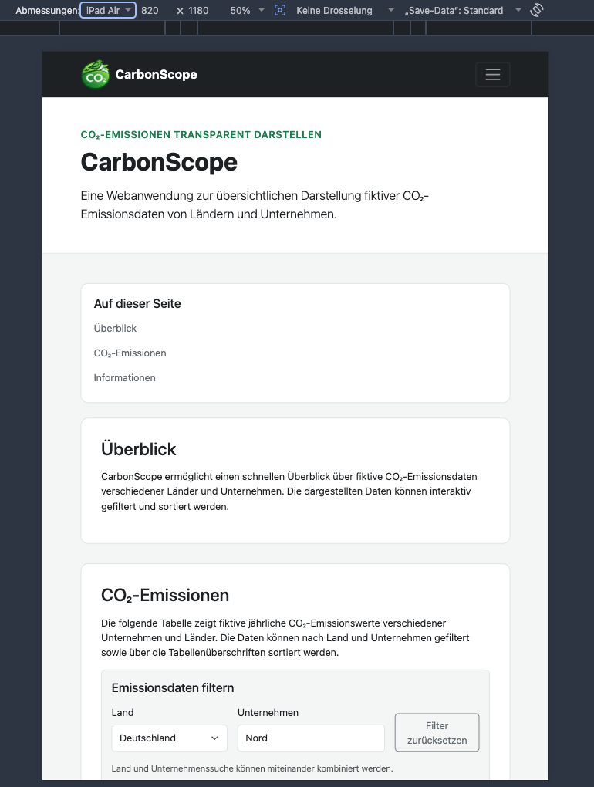

# CO₂ Emissions Dashboard

Responsive Webanwendung zur übersichtlichen Darstellung fiktiver CO₂-Emissionsdaten von Ländern und Unternehmen.

Das Projekt entsteht im Rahmen des IU-Kurses  
**IPWA01-01 – Programmierung von Webanwendungsoberflächen**.

## Projektstatus

Die funktionale Umsetzung ist abgeschlossen und wurde systematisch getestet und dokumentiert.

Aktuelle Version: `v0.9.0`

### Aktueller Entwicklungsstand

- Projektplanung abgeschlossen
- HTML5-Grundgerüst erstellt
- Bootstrap 5 eingebunden
- CarbonScope-Logo integriert
- Favicon eingebunden
- Header und globale Navigation umgesetzt
- lokale Seitennavigation umgesetzt
- Hauptinhaltsbereich und Footer umgesetzt
- fiktiver CO₂-Emissionsdatensatz erstellt
- Emissionstabelle dynamisch mit JavaScript erzeugt
- Filterung nach Land umgesetzt
- Suche nach Unternehmen umgesetzt
- kombinierte Filterung umgesetzt
- Sortierung nach Land umgesetzt
- Sortierung nach Unternehmen umgesetzt
- numerische Sortierung nach CO₂-Emissionen umgesetzt
- Zurücksetzen der Filter umgesetzt
- LTR- und RTL-Schriftkulturen berücksichtigt
- Position der lokalen Navigation abhängig von der Schriftkultur umgesetzt
- manuelle Auswahl der Schriftkultur integriert
- Auswahl der Schriftkultur lokal im Browser gespeichert
- freie Texteingaben normalisiert und in ihrer Länge begrenzt
- Eingaben mit festgelegten Werten über Allow-Lists validiert
- gespeicherte Werte aus `localStorage` erneut validiert
- dynamische Textausgaben sicher verarbeitet
- HTML-Injection- und XSS-Tests erfolgreich durchgeführt
- Desktop-, Tablet- und Smartphone-Darstellung optimiert
- responsive Emissionstabelle mit horizontalem Scrollbereich umgesetzt
- sichtbare Tastatur-Fokuszustände ergänzt
- Skip-Link zum Hauptinhalt integriert
- Sortierfunktionen für die Tastaturbedienung optimiert
- Screenreader-Rückmeldungen für Tabelle und Sortierung ergänzt
- semantische Beschriftungen und ARIA-Attribute erweitert
- Einstellung für reduzierte Animationen berücksichtigt
- systematische Funktionsprüfung durchgeführt
- Responsive Design auf mehreren Bildschirmgrößen geprüft
- Anwendung in Google Chrome und Apple Safari getestet
- Projektscreenshots erstellt und dokumentiert

Als nächster Schritt erfolgt der abschließende Qualitätscheck mit Validierung des Quellcodes und Veröffentlichung über GitHub Pages.

## Geplante letzte Schritte

- HTML abschließend validieren
- JavaScript abschließend überprüfen
- CSS abschließend überprüfen
- ungenutzten Code entfernen
- GitHub Pages aktivieren
- finale Projektdokumentation prüfen
- Version `v1.0.0` veröffentlichen

## Funktionen

### Emissionsdaten

CarbonScope stellt zwölf fiktive Unternehmensdatensätze aus verschiedenen europäischen Ländern dar.

Die Tabelle enthält:

- Land
- Unternehmen
- jährliche CO₂-Emissionen

### Filterung

Die Datensätze können gefiltert werden nach:

- Land
- Unternehmen

Beide Filter können miteinander kombiniert werden.

### Sortierung

Die Tabelle kann auf- und absteigend sortiert werden nach:

- Land
- Unternehmen
- CO₂-Emissionen

### Schriftkulturen

Die Position der lokalen Navigation berücksichtigt unterschiedliche Schriftkulturen.

- LTR: lokale Navigation links vom Hauptinhalt
- RTL: lokale Navigation rechts vom Hauptinhalt

Die deutschsprachigen Inhalte selbst bleiben dabei unverändert lesbar.

### Responsive Design

Die Benutzeroberfläche ist für unterschiedliche Bildschirmgrößen optimiert.

Berücksichtigt werden insbesondere:

- Desktop
- Tablet
- Smartphone

Auf kleinen Displays besitzt die Emissionstabelle einen eigenen horizontalen Scrollbereich.

### Barrierearmut

Die Anwendung enthält grundlegende Maßnahmen zur Verbesserung der Zugänglichkeit:

- semantische HTML-Struktur
- Skip-Link zum Hauptinhalt
- sichtbare Tastatur-Fokuszustände
- per Tastatur bedienbare Sortierfunktionen
- Wiederherstellung des Tastaturfokus nach einer Sortierung
- ARIA-Beschriftungen
- Screenreader-Statusmeldungen
- Berücksichtigung reduzierter Animationen

## Sicherheitskonzept

Benutzereingaben werden grundsätzlich als nicht vertrauenswürdig behandelt.

Zur Absicherung verwendet CarbonScope unter anderem:

- Normalisierung freier Texteingaben
- Begrenzung der maximalen Eingabelänge
- Allow-Lists für Eingaben mit festgelegten Werten
- erneute Validierung gespeicherter Werte
- sichere DOM-Manipulation mit `textContent`
- Verzicht auf die Verarbeitung von Benutzereingaben über `innerHTML`

Dadurch werden eingegebene HTML- oder JavaScript-Inhalte nicht als ausführbarer Code interpretiert.

Die Sicherheitsmaßnahmen wurden mit HTML- und JavaScript-ähnlichen Eingaben getestet.

## Tests

Die Anwendung wurde systematisch auf folgende Bereiche geprüft:

- Laden und Darstellung der Emissionsdaten
- Filterung
- kombinierte Filterung
- Sortierung
- LTR- und RTL-Darstellung
- lokale Speicherung der Schriftkultur
- sichere Verarbeitung von Benutzereingaben
- Tastaturbedienbarkeit
- Responsive Design
- Browserkonsole

### Getestete Browser

- Google Chrome
- Apple Safari

Bei Safari muss für eine vollständige Navigation über alle interaktiven Seitenelemente die entsprechende Tastaturnavigation des Browsers beziehungsweise von macOS aktiviert sein.

## Screenshots

### Desktop – LTR



### Desktop – RTL



### Smartphone



### Filterung und Sortierung



### Tablet



## Technologien

- HTML5
- CSS3
- Bootstrap 5
- Vanilla JavaScript
- Git
- GitHub
- GitHub Pages

## Bildnachweis

Das CarbonScope-Logo wurde 2026 mit ChatGPT erstellt. Ausgangsprompt: „CO₂-Logo mit Sperling in Grün“, anschließend iterativ angepasst.

## Projektstruktur

```text
assets/
├── css/
│   └── styles.css
├── img/
│   └── logo.svg
└── js/
    ├── app.js
    ├── data.js
    ├── direction.js
    ├── filters.js
    ├── security.js
    └── table.js

docs/
├── screenshots/
│   ├── 01-desktop-ltr.png
│   ├── 02-desktop-rtl.png
│   ├── 03-smartphone-430px.png
│   ├── 04-filter-sortierung.png
│   └── 05-tablet-820px.png
├── PROJECT_PLAN.md
└── TESTING.md